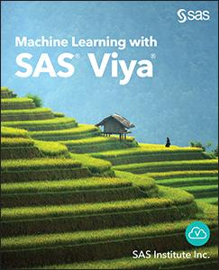

## Machine Learning with SAS® Viya®
By SAS Institute Inc.

This repository contains the sample code for the book <i>Machine Learning with SAS® Viya®.</i>
 
Data files are SAS data sets. 

## Description

**Master machine learning with SAS® Viya®!** 

Machine learning can feel intimidating for new practitioners. *Machine Learning with SAS® Viya®* provides everything you need to know to get started with machine learning in SAS Viya, including decision trees, neural networks, and support vector machines. The analytics life cycle is covered from data preparation and discovery to deployment. 

Working with open-source code? *Machine Learning with SAS® Viya®* has you covered – step-by-step instructions are given on how to use SAS Model Manager tools with open source. SAS Model Studio features are highlighted to show how to carry out machine learning in SAS Viya. Demonstrations, practice tasks, and quizzes are included to help sharpen your skills.

In this book, you will learn about:

- Supervised and unsupervised machine learning
- Data preparation and dealing with missing and unstructured data
- Model building and selection 
- Improving and optimizing models
- Model deployment and monitoring performance

##Details
*Epub* ISBN: 978-1-951685-37-9 
*Kindle* ISBN: 978-1-951685-38-6  
*PDF* ISBN: 978-1-951685-31-7  
*Paperback* ISBN: 978-1-951685-30-0  
*Hardback* ISBN: 978-1-951685-39-3

<a href="https://www.sas.com/storefront/aux/en/spmlviya/74588_excerpt.pdf">Table of Contents and Excerpt</a>

About the Authors 
<a href="https://support.sas.com/en/books/authors/sas-institute-inc.html">SAS Institute Inc.</a>

  

## License

This project is licensed under the [Apache 2.0 License](./LICENSE).

